# NIBRAS / نِبراس 🌍

## A small public window into a much larger project

NIBRAS is the current name of the project previously called SMPI. I am developing it around a question that kept getting bigger: how can people make sense of local market prices when information is fragmented, connectivity is unreliable, and trust is part of the problem?

This showcase is only a brief glimpse into the depth and scale of the wider project. It shares selected interface captures and a few design decisions. The full application, backend, data, internal research, specifications and development history remain private. This is a portfolio showcase, not an open-source release of NIBRAS.

## What I have been working on 🛠️

The work brings together product requirements, Arabic interface design, local storage and synchronization, market-data modeling, trust, and maps. My role includes researching the problem, planning the system, connecting these areas, shaping the implementation and reviewing the results.

I enjoy the parts where a decision in one area changes everything around it. An offline action changes the synchronization model. A local price needs a location and a date. A confidence label needs an explanation people can read.

## View the selected captures

Open [the gallery](index.html), or browse [the image files](assets/).

These are genuine application screenshots supplied by the project owner from his physical device. They show captured development interface states. Prices, counts, confidence labels and place markers shown inside them are not presented here as verified current market facts, deployment results, or live user statistics. The historical captures may show earlier wording and visual identity.

## Three decisions behind the work 🔍

**Arabic belongs at the foundation.** Language, reading direction, numbers and local context shape the interface, rather than being added after the layout is finished.

**An observation needs context.** Product, unit, place, time and source matter alongside the price. A neat chart cannot replace those questions.

**Connection gaps belong in the design.** Local storage, queued submissions and synchronization need explicit states. The UI should help people understand what has been saved and what still needs delivery.

## Scope and rights

This selection does not establish public deployment, active merchant partnerships, a production AI model, or measured nationwide impact. It is a selected view of ongoing work.

All rights reserved for the original NIBRAS materials. No permission to reuse the application or its assets is granted by this publication. Third-party rights remain with their owners. Map screenshots retain their visible OpenStreetMap and CARTO credits; see [attributions](ATTRIBUTIONS.md).

[Khaled on GitHub](https://github.com/Kaldx5) · [LinkedIn](https://www.linkedin.com/in/khaled-alrefai-668079273/)

## Visual preview 📱

[Open the live visual gallery](https://kaldx5.github.io/NIBRAS-Showcase/) · [Explore selected HTML design screens](https://kaldx5.github.io/NIBRAS-Showcase/design/)

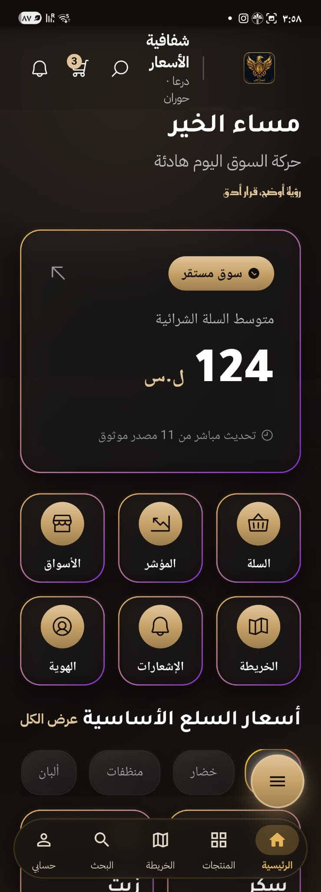 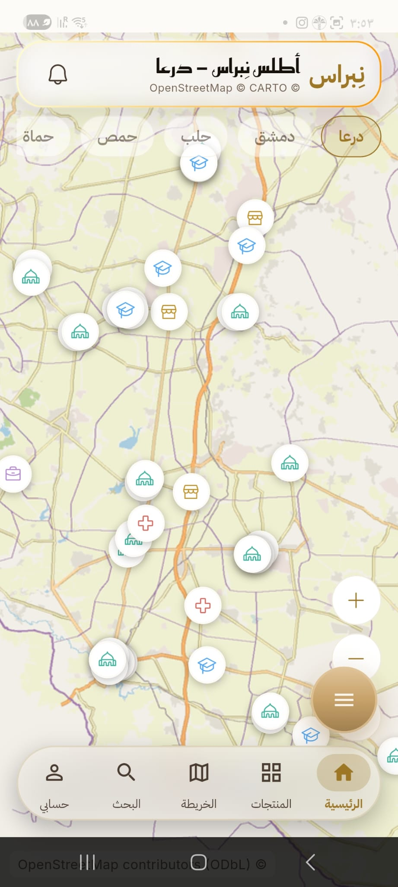 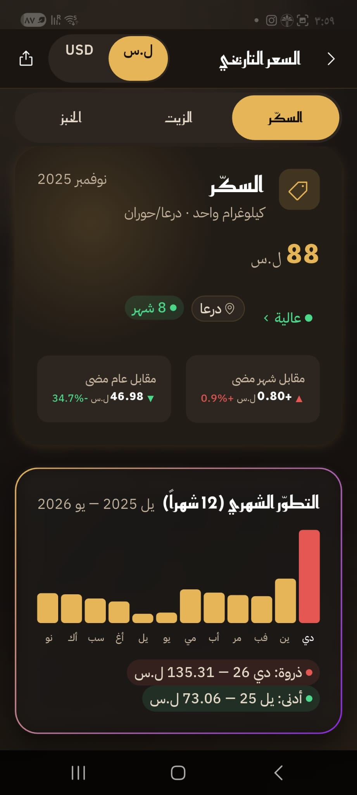

The design selection adds offline workflows, trust, contribution, store comparison, regions, merchants, business reporting and operations. HTML files render through the live gallery; GitHub itself displays HTML source rather than running it inside a README.

## Eight design studies, shown here

These are captures of the selected HTML studies, with example content. They sit alongside the physical-device captures above. Open each image for the full view, or follow its link to explore the HTML.

### Offline and queued work

[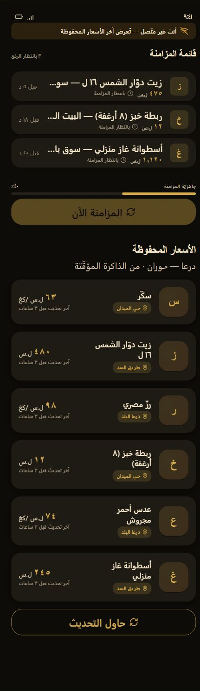](https://kaldx5.github.io/NIBRAS-Showcase/design/screens/offline.html)

### Trust and transparency

[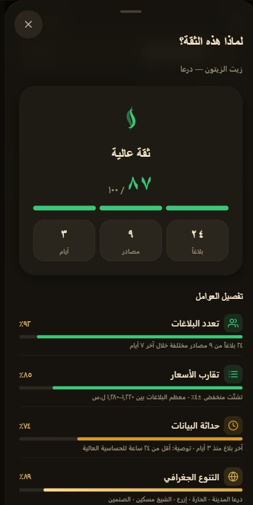](https://kaldx5.github.io/NIBRAS-Showcase/design/screens/trust_transparency.html)

### Contributing an observation

[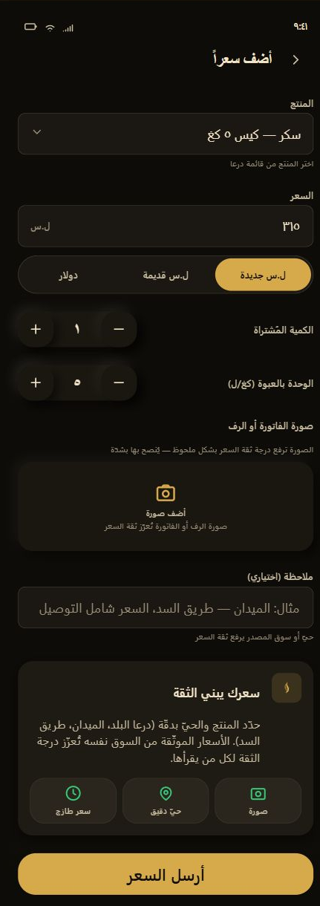](https://kaldx5.github.io/NIBRAS-Showcase/design/screens/add_price.html)

### Comparing stores

[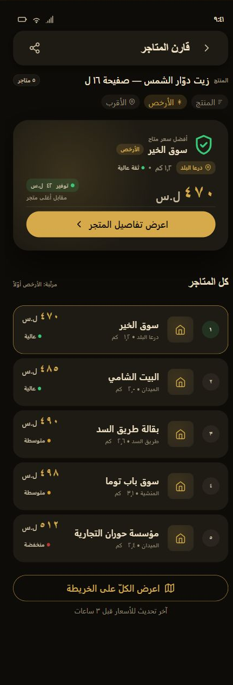](https://kaldx5.github.io/NIBRAS-Showcase/design/screens/store_compare.html)

### Choosing local context

[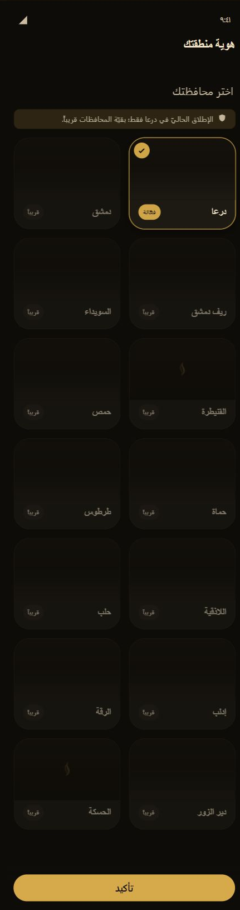](https://kaldx5.github.io/NIBRAS-Showcase/design/screens/region_picker.html)

### Merchant onboarding

[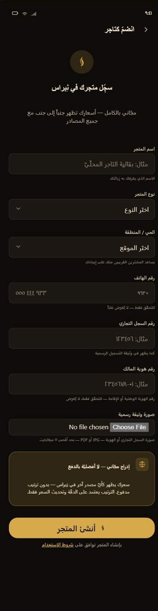](https://kaldx5.github.io/NIBRAS-Showcase/design/screens/merchant_onboard.html)

### Business reporting

[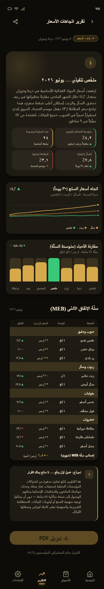](https://kaldx5.github.io/NIBRAS-Showcase/design/screens/b2b_report.html)

### Operations and governance

[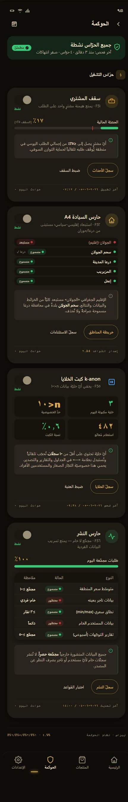](https://kaldx5.github.io/NIBRAS-Showcase/design/screens/ops_governance.html)

